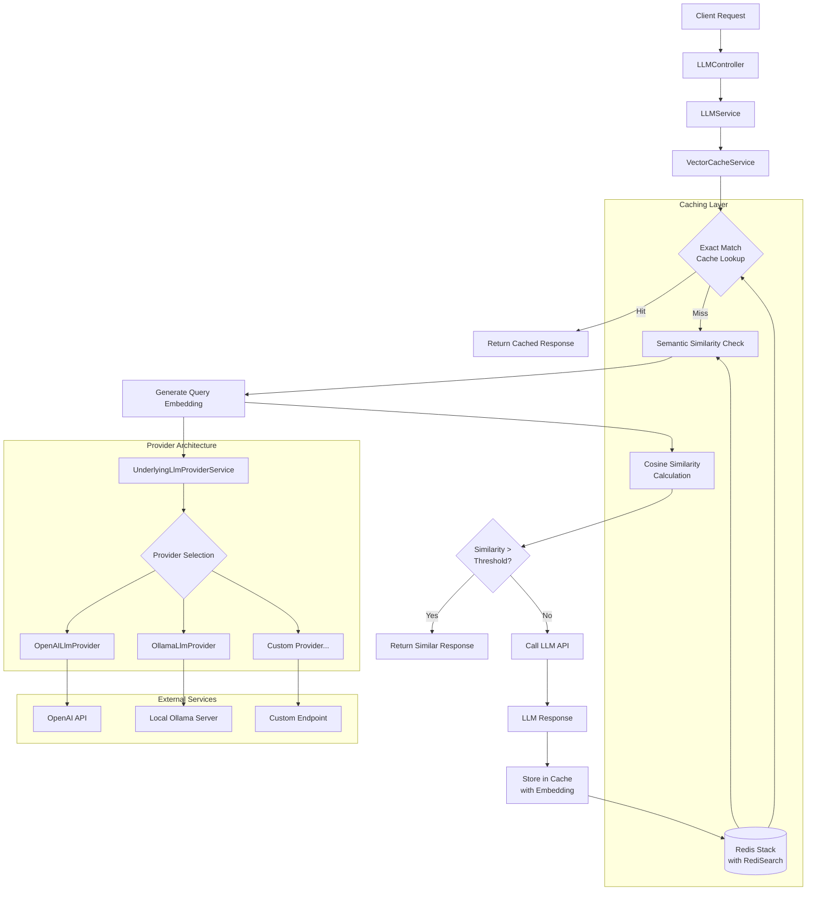

# LLM Vector Cache with Spring Boot

[](https://www.java.com/)
[](https://spring.io/projects/spring-boot)
[](https://maven.apache.org/)
[](https://redis.io/docs/stack/)
[](https://openai.com/)
[](https://www.docker.com/)
[](LICENSE)

A high-performance LLM cache implementation using vector similarity matching with Redis and multiple LLM providers (OpenAI, Ollama).

## Features

- **Dual-Layer Caching**: Exact string matching + semantic similarity
- **Multiple LLM Providers**: OpenAI API or Local Ollama support
- **Vector Search**: Redis with RediSearch for efficient similarity searches
- **Async Operations**: Non-blocking cache operations using CompletableFuture
- **Cost Savings Dashboard**: Real-time metrics and cost analysis
- **Configurable**: Similarity thresholds, TTL settings, and more
- **Monitoring**: Built-in cache statistics and health endpoints

## Requirements

### System Requirements

#### Minimum Hardware
- **CPU**: 2 cores (4 cores recommended)
- **RAM**: 2GB minimum (4GB recommended for production)
- **Storage**: 5GB free space (for dependencies, models, and cache)
- **Network**: Broadband internet (for OpenAI API) or local network (for Ollama)

#### Software Dependencies
- **Java**: 17 or higher (OpenJDK or Oracle JDK)
- **Maven**: 3.6+ for building from source
- **Docker**: 20.10+ with Docker Compose for containerized deployment

#### Performance Recommendations
- **Development**: 4GB RAM, 2 CPU cores, SSD storage
- **Production**: 8GB+ RAM, 4+ CPU cores, NVMe SSD
- **High Volume**: 16GB+ RAM, 8+ CPU cores, dedicated Redis instance

### LLM Provider Requirements

#### Option 1: Local Ollama (Recommended)
- **Ollama Installation**: Latest version from [ollama.ai](https://ollama.ai)
- **Model Storage**: 2-8GB per model (depending on model size)
- **Network**: Local network access (default: localhost:11434)
- **Supported Models**: 
  - `qwen2.5-coder:3b` (recommended, ~2GB)
  - `mistral:latest` (~4GB)
  - `llama2:7b` (~4GB)
  - Any Ollama-compatible model

#### Option 2: OpenAI API
- **API Key**: Valid OpenAI API key with usage credits
- **Internet**: Stable internet connection for API calls
- **Billing**: Pay-per-use pricing (~$0.003 per request)
- **Rate Limits**: Standard OpenAI API rate limits apply

### Infrastructure Requirements

#### Redis
- **Version**: Redis Stack (includes RediSearch)
- **Memory**: 512MB-2GB depending on cache size
- **Storage**: Persistent storage for cache data
- **Network**: Accessible from application (default: localhost:6379)

#### Optional: Production Deployment
- **Load Balancer**: For high availability
- **Monitoring**: Prometheus/Grafana for metrics
- **Logging**: ELK stack or similar for log aggregation
- **Backup**: Redis backup strategy for cache persistence

### Platform Compatibility

#### Operating Systems
- **Linux**: Ubuntu 18.04+, RHEL 8+, CentOS 8+, Debian 10+
- **macOS**: 10.15+ (Catalina) with Intel or Apple Silicon
- **Windows**: Windows 10/11 with Docker Desktop or WSL2

#### Container Platforms
- **Docker**: 20.10+ with Docker Compose 2.0+
- **Kubernetes**: 1.20+ (for production deployments)
- **Podman**: 4.0+ (alternative to Docker)

#### Cloud Platforms
- **AWS**: ECS, EKS, or EC2 with ElastiCache Redis
- **Google Cloud**: GKE, Cloud Run, or Compute Engine with Memorystore
- **Azure**: AKS, Container Instances, or VMs with Azure Cache for Redis
- **DigitalOcean**: App Platform, Kubernetes, or Droplets

## Quick Start Guide

### 🦙 Option 1: Local Ollama (Recommended Default)

**Step 1: Install Ollama**
```bash
# macOS
brew install ollama

# Linux
curl -fsSL https://ollama.ai/install.sh | sh
```

**Step 2: Start Ollama and Pull Model**
```bash
# Start Ollama (in terminal 1)
ollama serve

# Pull model (in terminal 2)  
ollama pull qwen2.5-coder:3b
```

**Step 3: Start Application**
```bash
# Use the easy startup script
./start-ollama.sh

# Or manually:
cd docker
docker-compose -f docker-compose.ollama.yml up -d
```

### 🤖 Option 2: OpenAI API

**Step 1: Get API Key**
- Visit https://platform.openai.com/account/api-keys
- Create new API key (starts with `sk-`)

**Step 2: Set Environment Variable**
```bash
export OPENAI_API_KEY=sk-your-actual-api-key-here
```

**Step 3: Start Application**
```bash
# Use the easy startup script
./start-openai.sh

# Or manually:
docker-compose up -d
```

### 🎯 Access Your Dashboard

After starting either option:
- **Dashboard**: http://localhost:8080 (ASCII art + live stats!)
- **API**: http://localhost:8080/api/llm/generate
- **Cache Stats**: http://localhost:8080/api/llm/cache/stats

### 4. Test the Application

```bash
# Health check
curl http://localhost:8080/api/llm/health

# Generate response (will be cached)
curl -X POST http://localhost:8080/api/llm/generate \
  -H "Content-Type: application/json" \
  -d '{
  "prompt": "Tell me the capital of France",
  "options": {
    "model": "qwen2.5-coder:3b",
    "temperature": 0.7,
    "max_tokens": 100
  }
}'

# Check cache stats
curl http://localhost:8080/api/llm/cache/stats
```

## API Endpoints

### Generate Response

```bash
POST /api/llm/generate
{
  "prompt": "Your question here",
  "options": {
    "model": "gpt-3.5-turbo"
  }
}
```

### Get Cache Statistics

```bash
GET /api/llm/cache/stats
```

### Health Check

```bash
GET /api/llm/health
```

### Evict Expired Entries

```bash
POST /api/llm/cache/evict
```

## Testing with Postman

A comprehensive Postman collection is included for testing all API endpoints.

### Importing the Collection

1. Open Postman
2. Click **Import** button (or File → Import)
3. Select the file: `LLM-Vector-Cache.postman_collection.json`
4. Click **Import**

### Running the Collection

1. Set your environment variables (optional):

   - Click the **Environment** quick look (eye icon)
   - Add `baseUrl` if not using default `http://localhost:8080`

2. Run individual requests:

   - Navigate to the imported collection
   - Choose from 16+ pre-configured requests organized in folders:
     - **Health & Monitoring**: System health checks
     - **LLM Generation**: Various prompt examples
     - **Cache Management**: Cache control operations
     - **Test Scenarios**: Cache hit/miss testing

3. Run the entire collection:
   - Right-click the collection → **Run collection**
   - Configure iterations and delays as needed
   - Click **Run LLM Vector Cache API**

### Collection Features

- **Pre-configured Examples**: 16+ ready-to-use API requests
- **Semantic Testing**: Examples to test cache similarity matching
- **Error Scenarios**: Test cases for error handling
- **Response Validation**: Automatic response time checks
- **Multiple Models**: Examples for GPT-3.5 and GPT-4

## Configuration

Key configuration options in `application.yml`:

- `cache.similarity.threshold`: Similarity threshold for semantic matching (0.0-1.0)
- `cache.ttl.hours`: Cache entry TTL in hours
- `llmprovider.openai.model`: OpenAI embedding model to use
- `llmprovider.active`: Active LLM provider (openai/ollama)
- `spring.redis.*`: Redis connection settings

## Architecture

The system uses a dual-layer caching approach with a modular provider-based architecture:



### Core Components

1. **Exact Match Cache**: Fast string-based lookups using Redis hash keys
2. **Semantic Cache**: Vector similarity search with configurable cosine similarity threshold
3. **UnderlyingLlmProviderService**: Unified facade for multiple embedding providers
4. **Provider Strategy Pattern**: Pluggable providers (OpenAI, Ollama, custom)

### How it Works

1. **Request Processing**: LLMController receives request and delegates to LLMService
2. **Cache Lookup**: VectorCacheService first tries exact string match in Redis
3. **Semantic Matching**: On cache miss, generates embedding via UnderlyingLlmProviderService
4. **Provider Selection**: Service automatically selects best available provider
   (OpenAI/Ollama/custom)
5. **Similarity Calculation**: Compares query embedding with cached embeddings using cosine
   similarity
6. **Threshold Matching**: Returns cached response if similarity exceeds configured threshold
7. **LLM Fallback**: Calls actual LLM API if no semantic match found
8. **Cache Storage**: Stores new response with its embedding for future semantic matching

## Redis Vector Capabilities

This project leverages [Redis Stack](https://redis.io/docs/stack/) with the
[RediSearch module](https://redis.io/docs/stack/search/) for advanced vector similarity search
capabilities:

### Key Technologies

- **Jedis Client**: We use [Jedis 5.0+](https://github.com/redis/jedis) with built-in RediSearch
  support for vector operations
- **Redis Stack**: Includes [RediSearch 2.0+](https://redis.io/docs/stack/search/reference/vectors/)
  with native vector similarity search
- **Vector Indexing**: Supports FLAT and HNSW indexing algorithms for efficient k-NN searches

### Vector Search Features

- **Embedding Storage**: Store OpenAI embeddings (1536 dimensions for text-embedding-ada-002) as
  FLOAT32 vectors
- **Cosine Similarity**: Built-in distance metrics including COSINE, L2, and IP (Inner Product)
- **Hybrid Queries**: Combine vector similarity with filters on metadata fields
- **Real-time Indexing**: Automatic indexing of new vectors without rebuilding
- **Scalability**: Handles millions of vectors with sub-millisecond query times

### Implementation Details

```java
// Vector index creation in Redis
FT.CREATE idx:cache
  ON HASH
  PREFIX 1 cache:
  SCHEMA
    embedding VECTOR FLAT 6
      TYPE FLOAT32
      DIM 1536
      DISTANCE_METRIC COSINE
    prompt TEXT
    response TEXT
    created_at NUMERIC
```

### Performance Optimizations

- **Pre-filtering**: Reduces search space using metadata filters before vector search
- **Batch Operations**: Pipeline multiple Redis commands for improved throughput
- **Connection Pooling**: Jedis pool configuration for optimal resource utilization
- **Lazy Loading**: Embeddings generated only when needed for semantic search

### Learn More

- [Redis Vector Similarity Docs](https://redis.io/docs/stack/search/reference/vectors/)
- [RediSearch Query Syntax](https://redis.io/docs/stack/search/reference/query_syntax/)
- [Jedis RediSearch Integration](https://github.com/redis/jedis/tree/master/src/main/java/redis/clients/jedis/search)
- [Vector Database Benchmarks](https://redis.io/docs/stack/search/reference/vectors/#vector-similarity-examples)

## Production Deployment

### Using Docker

#### Quick Start

```bash
# Build the application
mvn clean package

# Start with Docker Compose
cd docker
docker-compose up -d
```

#### Custom Port Configuration

Create a `.env` file in the project root (copy from `.env.example`):

```bash
# Custom ports
APP_PORT=8090
REDIS_PORT=6380
REDIS_INSIGHT_PORT=8002

# Your API key
OPENAI_API_KEY=your_api_key_here
```

Then start with custom configuration:

```bash
cd docker
docker-compose up -d
```

### Environment Variables

#### Core Configuration

- `OPENAI_API_KEY`: Your OpenAI API key
- `REDIS_HOST`: Redis hostname (default: localhost)
- `REDIS_PORT`: Redis port (default: 6379)
- `CACHE_SIMILARITY_THRESHOLD`: Similarity threshold (default: 0.95)
- `CACHE_TTL_HOURS`: Cache TTL in hours (default: 24)

#### Docker Port Configuration

- `APP_PORT`: Host port for the application (default: 8080)
- `REDIS_PORT`: Host port for Redis (default: 6379)
- `REDIS_INSIGHT_PORT`: Host port for Redis Insight web UI (default: 8001)

## Performance Tuning

1. **Similarity Threshold**: Lower values increase cache hits but may reduce accuracy
2. **TTL Settings**: Balance between cache freshness and performance
3. **Redis Configuration**: Tune Redis memory and persistence settings
4. **Connection Pooling**: Adjust Jedis pool settings for your load

## Monitoring

The application provides several monitoring endpoints:

- `/actuator/health`: Application health status
- `/actuator/metrics`: Application metrics
- `/api/llm/cache/stats`: Cache-specific statistics

## Troubleshooting

### Common Issues

#### Java Version Problems
```bash
# Check Java version
java -version

# Should show Java 17 or higher
# If not, install OpenJDK 17+
sudo apt install openjdk-17-jdk  # Ubuntu/Debian
brew install openjdk@17          # macOS
```

#### Ollama Connection Issues
```bash
# Check if Ollama is running
curl http://localhost:11434/api/version

# Start Ollama if not running
ollama serve

# Check if model is available
ollama list

# Pull model if missing
ollama pull qwen2.5-coder:3b
```

#### Redis Connection Problems
```bash
# Check Redis container status
docker ps | grep redis

# Start Redis if not running
cd docker && docker-compose up -d redis

# Test Redis connection
docker exec -it redis-stack redis-cli ping
```

#### OpenAI API Issues
```bash
# Verify API key is set
echo $OPENAI_API_KEY

# Test API key validity
curl https://api.openai.com/v1/models \
  -H "Authorization: Bearer $OPENAI_API_KEY"
```

#### Docker Issues
```bash
# Check Docker daemon
docker version

# Free up space if needed
docker system prune -f

# Rebuild containers
docker-compose down && docker-compose up --build
```

### Performance Optimization

#### Memory Issues
- Increase JVM heap size: `-Xmx4g -Xms2g`
- Monitor memory usage: `/actuator/metrics/jvm.memory.used`
- Consider Redis memory policies for large caches

#### Slow Response Times
- Check similarity threshold (lower = more cache hits)
- Monitor Redis performance: `redis-cli --latency`
- Consider model size vs. quality trade-offs for Ollama

#### High API Costs (OpenAI)
- Increase similarity threshold to improve cache hit rate
- Monitor cost savings in dashboard
- Consider switching to local Ollama for development

### Getting Help

1. **Check Logs**: Application logs show detailed error information
2. **Health Endpoints**: Use `/api/llm/health` for system status
3. **Cache Stats**: Monitor `/api/llm/cache/stats` for performance metrics
4. **GitHub Issues**: Report bugs at [project repository](https://github.com/your-repo/llm-vector-cache)

## Quick Reference

### Essential Commands
```bash
# Clone and setup
git clone <repository-url>
cd llm-vector-cache

# Ollama setup (recommended)
ollama serve                              # Start Ollama
ollama pull qwen2.5-coder:3b             # Pull model
./start-ollama.sh                        # Start application

# OpenAI setup (alternative)
export OPENAI_API_KEY=sk-your-key        # Set API key
./start-openai.sh                        # Start application

# Docker commands
docker-compose up -d                     # Start with OpenAI
docker-compose -f docker/docker-compose.ollama.yml up -d  # Start with Ollama
docker-compose down                      # Stop all services

# Testing
curl http://localhost:8080               # Dashboard
curl http://localhost:8080/api/llm/health  # Health check
./test.sh                               # Run API tests
```

### Key URLs
- **Dashboard**: http://localhost:8080
- **API**: http://localhost:8080/api/llm/generate  
- **Health**: http://localhost:8080/api/llm/health
- **Stats**: http://localhost:8080/api/llm/cache/stats
- **Redis Insight**: http://localhost:8001

## Inspired By

This project was inspired by
[Raul Junco's post on X](https://x.com/RaulJuncoV/status/1954876732261253578) about implementing LLM
caching with vector similarity search. Thanks for sharing the concept and sparking the idea for this
implementation!

## Contributing

1. Fork the repository
2. Create a feature branch
3. Make your changes
4. Add tests
5. Submit a pull request

## License

MIT License - see [LICENSE](LICENSE) file for details.
